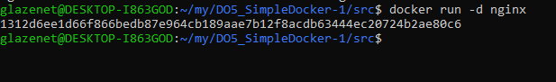

## Part 1. Готовый докер

- Качаем официальный образ nginx

</img>

- Проверяем наличие докер образа 

</img>

- Запускаем докер образ nginx

</img>

- Проверяем что образ запустился

</img>

- Запустим команду `docker inspect`
- Размер контейнера (в байтах)

</img>

- Список замапленных портов

</img>

- ip контейнера

</img>

- Остановим докер контейнер и проверим, что он остановился

</img>

- Запустим докер контейнер с портами 80:80 и 443:443

</img>

- Откроем базовую страницу nginx

</img>

- Перезапустим докер контейнер и проверим, что он перезапустился

</img>

## Part 2. Операции с контейнером

- Прочитали файл nginx.conf

</img>

- Создадим файл nginc.conf на нашем устройстве

</img>

- Настроим в нем по пути /status отдачу страницы статуса сервера nginx

</img>

</img>

- Скопируем файл конфигурации внутрь докер-образа

</img>

- Перезапустим nginx внутри докер-образа

</img>

- Откроем страничку со статусом сервера nginx

</img>

- Экспортируем контейнер в файл container.tar

</img>

- Остановим наш контейнер

</img>

- Удалим образ nginx

</img>

- Удалим контейнер

</img>

- Импортируем контейнер обратно

</img>

- Запустим контейнер

</img>

- Откроем страничку со статусом сервера nginx

</img>

